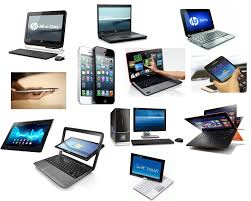
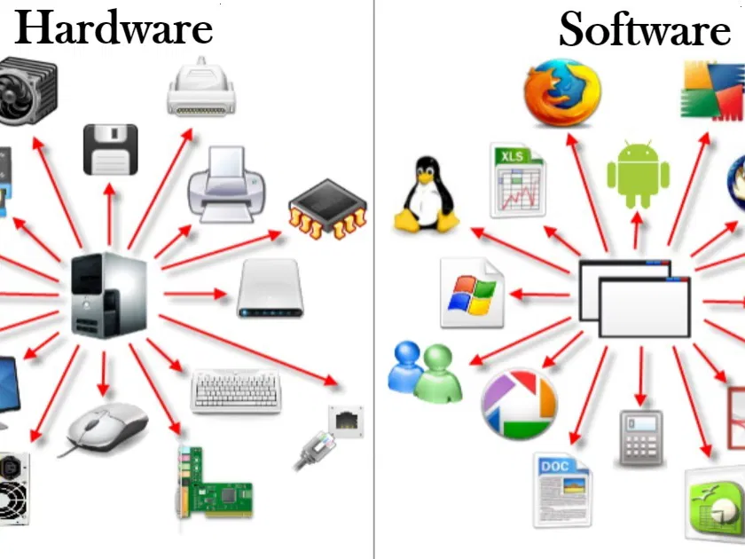
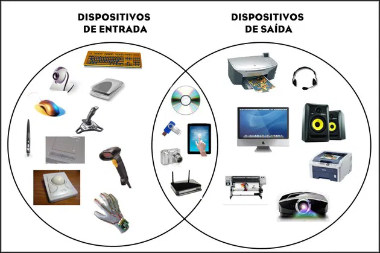
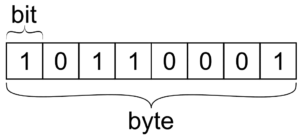
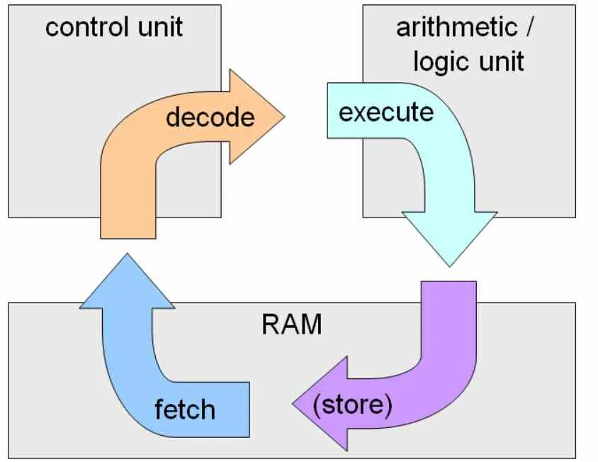
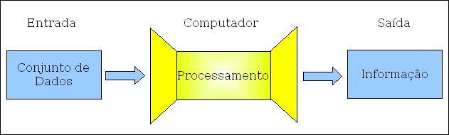
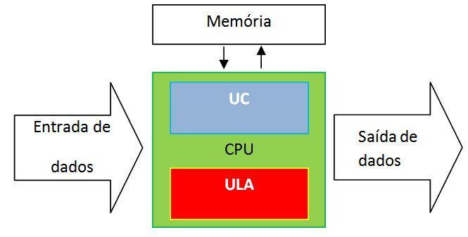

# Conceitos iniciais

## O que é um computador?
Um computador é uma máquina projetada para processar informações, ou seja, receber dados, realizar operações sobre eles e produzir resultados úteis. Ele pode executar uma ampla variedade de tarefas, desde cálculos matemáticos simples até aplicações complexas, como navegar na internet, editar imagens e rodar jogos.

### Computador como máquina de processamento de informações
O ponto central do computador é que ele transforma dados em informação útil.

- Entrada: recebe dados do mundo externo (como texto digitado, imagens capturadas por câmera ou sons captados por microfone).

- Processamento: manipula esses dados de acordo com instruções (programas) armazenados.

- Saída: apresenta resultados processados (como exibir uma imagem na tela, imprimir um documento ou emitir um som).

### Diferença entre hardware, software e firmware
| Termo        | O que é                                                                     | Exemplo                                                       |
| ------------ | --------------------------------------------------------------------------- | ------------------------------------------------------------- |
| **Hardware** | Parte física da máquina, os componentes tangíveis.                          | CPU, memória RAM, HD, monitor, teclado.                       |
| **Software** | Programas e sistemas que dizem ao hardware o que fazer.                     | Navegadores, editores de texto, jogos, sistemas operacionais. |
| **Firmware** | Software embutido em dispositivos de hardware, controlando funções básicas. | BIOS/UEFI da placa-mãe, firmware de impressoras e roteadores. |

## Componentes essenciais de um sistema computacional
Todo computador é formado por diversos componentes que trabalham juntos para processar informações de forma eficiente. Esses componentes podem ser classificados em cinco grandes grupos: Entrada, Processamento, Armazenamento, Saída e Entrada/Saída (I/O).

### Entrada
Os dispositivos de entrada são responsáveis por enviar dados para o computador, permitindo que ele receba informações do usuário ou do ambiente.

Exemplos comuns:
- Teclado: envia caracteres digitados para processamento.

- Mouse: envia informações sobre posição e cliques.

- Scanner e câmera: transformam imagens físicas em dados digitais.

- Microfone: captura sons para processamento.

- Tela touch: combina entrada e interação direta com o usuário.

Esses dispositivos são essenciais para que o computador receba informações externas e interaja com o mundo real.

### Processamento
O processamento é o núcleo do computador, realizado principalmente pela CPU (Unidade Central de Processamento). A CPU executa instruções de programas e controla o fluxo de dados entre os componentes do sistema.

A CPU possui dois elementos fundamentais:

- ULA (Unidade Lógica e Aritmética): realiza cálculos matemáticos e operações lógicas

- UC (Unidade de Controle): interpreta as instruções dos programas e coordena o funcionamento de todos os outros componentes.

Em resumo, a CPU é responsável por transformar os dados recebidos em informações úteis.

### Armazenamento
O armazenamento permite que os dados sejam guardados temporária ou permanentemente. Ele pode ser dividido em memória primária e memória secundária:

- RAM (Random Access Memory): memória volátil usada para armazenar temporariamente dados e instruções em uso. É rápida, mas perde o conteúdo quando o computador é desligado.

- ROM (Read-Only Memory): memória não volátil que contém instruções essenciais para inicializar o computador, como o BIOS.

- HD/SSD: dispositivos de armazenamento permanente usados para guardar arquivos, programas e o sistema operacional. Serão estudados com mais detalhes posteriormente.

### Saída
Os dispositivos de saída recebem dados processados pelo computador e os transformam em informações perceptíveis ao usuário.

Exemplos:
- Monitores: exibem imagens e informações visuais.

- Impressoras: produzem cópias físicas de documentos.

- Caixas de som e fones: reproduzem sons.
Esses dispositivos permitem que o usuário perceba os resultados do processamento.

### Entrada/Saída (I/O)
Alguns dispositivos realizam funções de entrada e saída ao mesmo tempo, conectando o computador a outros sistemas ou redes.

Exemplos:
- Placas de rede: permitem enviar e receber dados em redes de computadores.

- USB e portas externas: permitem transferência de dados entre dispositivos.

- Controladores e interfaces de sensores: possibilitam a comunicação com equipamentos externos.

---

## Unidades de medida da informação
Para entender como os computadores armazenam e processam dados, é essencial conhecer as unidades de medida da informação, que indicam a quantidade de dados que um dispositivo pode manipular ou armazenar.

### Bit
O bit (binary digit) é a menor unidade de informação em um computador.

- Pode assumir apenas dois valores: 0 ou 1.

- Representa conceitos simples como ligado/desligado, verdadeiro/falso ou presença/ausência de sinal.

Exemplo: em eletrônica digital, um bit é equivalente a um pequeno sinal elétrico que pode estar presente (1) ou ausente (0).

### Byte
O byte é uma unidade de informação composta por 8 bits.
- É a medida básica usada para representar caracteres, como letras, números e símbolos.

- Um byte pode representar 256 valores diferentes (de 0 a 255).

`2×2×2×2×2×2×2×2=28=256`

---

### Kilobyte, Megabyte, Gigabyte e Terabyte
Para medir volumes maiores de informação, usamos múltiplos do byte:

| Unidade  | Símbolo | Aproximadamente               | Observação                                                  |
| -------- | ------- | ----------------------------- | ----------------------------------------------------------- |
| Kilobyte | kB      | 1.024 bytes                   | Arredondado muitas vezes como 1.000 bytes em marketing.     |
| Megabyte | MB      | 1.024 kB ≈ 1 milhão de bytes  | Usado para arquivos de texto, imagens pequenas e programas. |
| Gigabyte | GB      | 1.024 MB ≈ 1 bilhão de bytes  | Usado para HDs, SSDs e filmes digitais.                     |
| Terabyte | TB      | 1.024 GB ≈ 1 trilhão de bytes | Usado para grandes HDs, servidores e backups.               |

## Ciclo de processamento básico
Todo computador segue um ciclo de processamento de informações, que descreve como os dados entram, são processados e gerados como saída. Esse ciclo é fundamental para entender o funcionamento de qualquer sistema computacional.

### 1 - Entrada de dados
O ciclo começa quando o computador recebe informações do usuário ou do ambiente por meio de dispositivos de entrada.
- Exemplos: teclado, mouse, scanner, microfone, sensores.

- O objetivo é capturar dados brutos que serão transformados em informações úteis.

Exemplo: ao digitar uma frase em um editor de texto, o teclado envia cada letra como dados para o computador.

### 2 - Processamento
Após a entrada, os dados são enviados para a CPU, que é responsável por processá-los:
- A ULA (Unidade Lógica e Aritmética) realiza cálculos e operações lógicas.

- A UC (Unidade de Controle) interpreta as instruções dos programas e coordena todo o fluxo de dados entre os componentes.

Exemplo: o computador transforma os códigos de cada tecla digitada em caracteres visíveis na tela.

### 3 - Armazenamento temporário (RAM)
Durante o processamento, os dados precisam ser armazenados temporariamente para que a CPU os acesse rapidamente.

- Isso é feito na RAM, que é uma memória volátil e muito rápida.

- Ela mantém os dados e instruções enquanto o programa está sendo executado, mas perde tudo quando o computador é desligado.

Exemplo: enquanto você escreve um documento, ele está sendo armazenado na RAM antes de ser salvo permanentemente no HD ou SSD.

### 4 - Saída
Depois que os dados são processados, o computador apresenta os resultados através de dispositivos de saída:

- Monitores mostram imagens e texto.

- Impressoras produzem documentos físicos.

- Alto-falantes reproduzem sons.

Exemplo: ao salvar um documento, o texto digitado aparece na tela e pode ser impresso, permitindo que o usuário veja o resultado do processamento.

---

## Arquitetura básica de hardware
A arquitetura de hardware descreve a organização interna de um computador e como seus componentes principais se conectam para executar tarefas. Compreender essa estrutura é essencial para entender tópicos mais avançados, como a Arquitetura de Von Neumann, barramentos, tipos de memória e processadores.

### CPU (Unidade Central de Processamento)
A CPU é o cérebro do computador, responsável por executar instruções e coordenar todas as atividades do sistema.

- Contém a ULA (Unidade Lógica e Aritmética), que realiza cálculos e operações lógicas.

- Contém a UC (Unidade de Controle), que interpreta instruções e direciona o fluxo de dados entre os outros componentes.

Sem a CPU, o computador não conseguiria processar nenhuma informação.

### Memória
A memória armazena temporária ou permanentemente os dados e instruções que a CPU precisa acessar.

- Memória primária: RAM (volátil) e ROM (não volátil).

- Memória cache: memória ultrarrápida dentro da CPU usada para armazenar dados frequentemente acessados.

A memória é essencial para que a CPU trabalhe de forma rápida e eficiente.

### Armazenamento
O armazenamento guarda dados de forma permanente, mesmo quando o computador está desligado.

- Exemplos: HDs, SSDs, SSHDs, unidades externas.

- Serve para guardar o sistema operacional, programas, arquivos do usuário e dados de longo prazo.

Enquanto a RAM é temporária, o armazenamento garante que os dados não se percam.

### Barramentos
Os barramentos são vias de comunicação internas que conectam todos os componentes do computador, permitindo que eles troquem dados e sinais de controle.

- Tipos principais:
    - Barramento de dados: transporta os dados entre CPU, memória e periféricos.

    - Barramento de endereço: indica onde os dados devem ser lidos ou escritos.

    - Barramento de controle: envia sinais de comando e sincronização entre os componentes.

Barramentos eficientes garantem que a comunicação interna seja rápida e confiável.

### Periféricos
Os periféricos são dispositivos externos que permitem a interação do usuário com o computador ou a conexão com outros sistemas.

- Entrada: teclado, mouse, scanner.

- Saída: monitor, impressora, caixas de som.

- Entrada/Saída (I/O): USB, placas de rede, sensores.

Os periféricos transformam o computador em uma ferramenta completa e funcional para o usuário.

