# Evolução dos Computadores (Gerações)
A evolução dos computadores é marcada pela busca contínua por maior velocidade, capacidade de processamento, eficiência energética e miniaturização dos componentes. Desde os primeiros computadores, criados na década de 1940, até os dispositivos modernos, cada avanço tecnológico permitiu computadores mais rápidos, menores, mais confiáveis e acessíveis.

## Introdução à evolução

### Por que os computadores evoluíram?
1 - Velocidade:

    - Os primeiros computadores eram extremamente lentos, realizando apenas milhares de operações por segundo.

    - A necessidade de processar grandes volumes de dados rapidamente impulsionou o desenvolvimento de novos componentes e arquiteturas.

2 - Capacidade de armazenamento:

    - Armazenar dados e instruções era limitado e caro nos primeiros sistemas (cartões perfurados, fitas magnéticas).

    - A evolução permitiu memórias maiores e mais rápidas, essenciais para programas complexos.

3 - Eficiência e confiabilidade:

    - Componentes antigos, como válvulas eletrônicas, consumiam muita energia e falhavam com frequência.

    - O avanço para transistores e circuitos integrados tornou os computadores mais confiáveis e econômicos.

4 - Miniaturização:

    - Reduzir o tamanho dos componentes permitiu a criação de computadores pessoais e, mais recentemente, dispositivos móveis como smartphones e tablets.

#### Hardware antigo vs moderno

| Característica         | Computadores antigos (1940–1960)     | Computadores modernos (atual)                          |
| ---------------------- | ------------------------------------ | ------------------------------------------------------ |
| **Processamento**      | Lento, CPU baseada em válvulas       | Rápido, CPUs com bilhões de transistores em microchips |
| **Tamanho**            | Ocupavam salas inteiras              | Cabe em uma mão (smartphones) ou em desktops compactos |
| **Memória**            | Cartões perfurados, fitas magnéticas | RAM, SSD, memória flash                                |
| **Consumo de energia** | Muito alto                           | Muito mais eficiente                                   |
| **Custo**              | Milhares ou milhões de dólares       | Acessível para consumidores e empresas                 |

## 1 - Primeira Geração (1940–1956)
A primeira geração de computadores marcou o início da era da computação, entre os anos 1940 e 1956. Esses computadores utilizavam válvulas eletrônicas (tubos a vácuo) para processar informações, tornando-os enormes, lentos e de alto consumo energético.

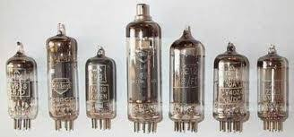
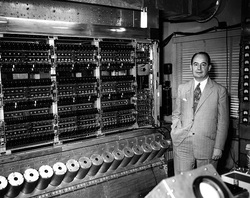

### Tecnologia
- Válvulas eletrônicas eram usadas para amplificar sinais e realizar operações lógicas.

- Eram grandes, frágeis e geravam muito calor, o que aumentava a chance de falhas.

### Memória
- Os dados eram armazenados em cartões perfurados e fitas magnéticas.
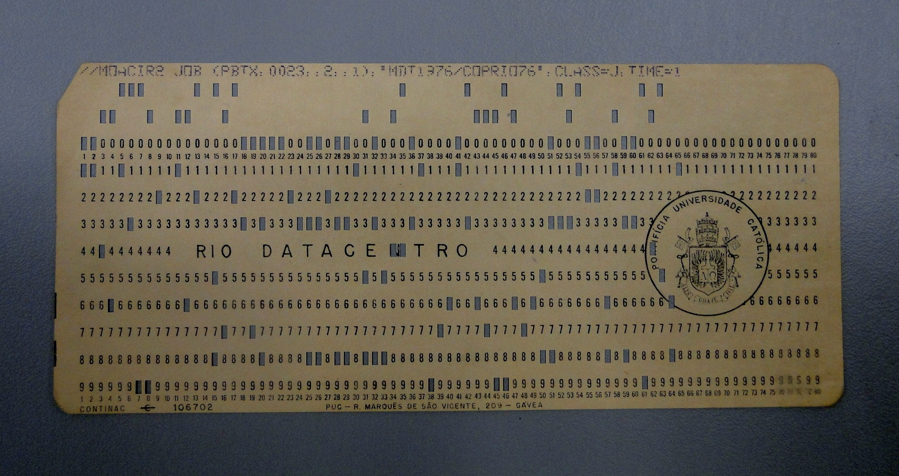

- Esses dispositivos permitiam apenas armazenamento limitado e leitura sequencial, o que tornava o processamento mais lento.

### Linguagem
- A programação era feita em linguagem de máquina, ou seja, códigos binários (0 e 1) diretamente interpretados pela máquina.

- Era um processo complexo e sujeito a erros humanos.

### Exemplos de computadores
- ENIAC (1945): um dos primeiros computadores eletrônicos de grande escala.
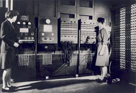

- UNIVAC I (1951): o primeiro computador comercial, usado em empresas e governo.

### Características gerais
- Ocupavam salas inteiras devido ao tamanho das válvulas e circuitos.

- Muito lentos em comparação com os padrões modernos.

- Caros e inacessíveis para uso doméstico.

- Consumo de energia elevado e alta taxa de falhas devido ao superaquecimento.

## 2 - Segunda Geração (1956–1963)
A segunda geração de computadores, que surgiu entre 1956 e 1963, marcou uma grande evolução em relação à primeira geração. Nessa fase, os transistores substituíram as válvulas eletrônicas, trazendo maior confiabilidade, velocidade e eficiência energética.

### Tecnologia
- Os transistores são componentes eletrônicos menores e mais confiáveis que as válvulas, capazes de amplificar sinais e realizar operações lógicas.

- Comparados às válvulas, consomem menos energia, geram menos calor e reduzem significativamente a taxa de falhas.

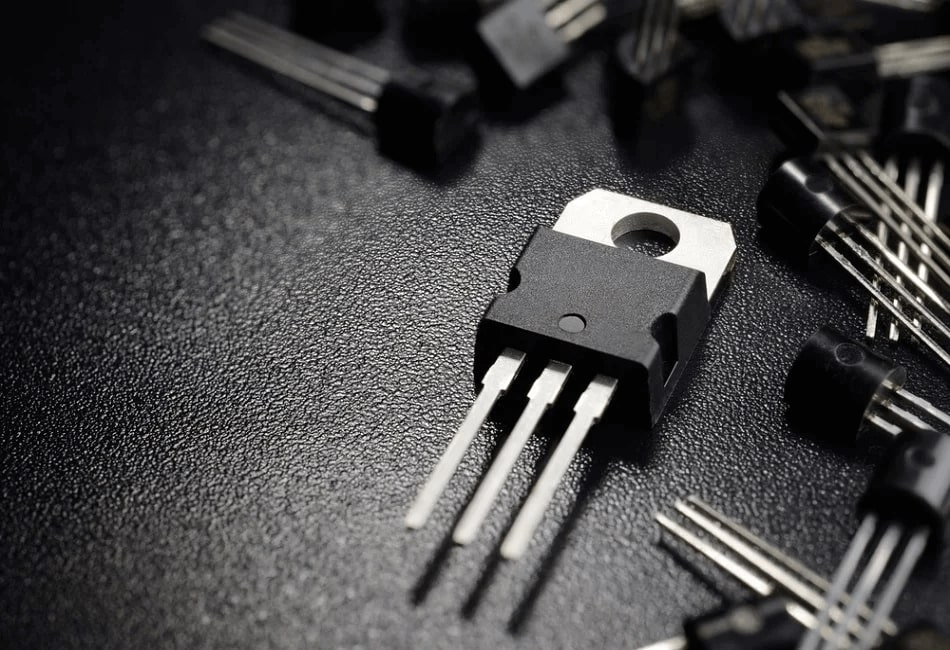

### Memória
- Os computadores da segunda geração usavam fitas magnéticas e começaram a utilizar os primeiros discos rígidos rudimentares.

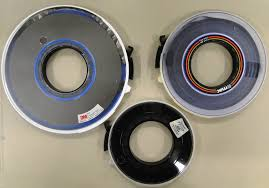

- Isso permitiu armazenamento de dados mais rápido e maior capacidade em relação à geração anterior.

### Linguagem de programação
- Surgem as linguagens assembly e as primeiras linguagens de alto nível, como FORTRAN e COBOL.

- Isso tornou a programação mais simples e menos suscetível a erros do que escrever diretamente em linguagem de máquina (binário).

### Características gerais
- Computadores menores que os da primeira geração, mas ainda grandes para os padrões atuais.

- Mais rápidos e confiáveis, com menor consumo de energia.

- Capazes de rodar programas mais complexos e realizar cálculos científicos ou empresariais de forma mais eficiente.

## 3 - Terceira Geração (1964–1971)
A terceira geração de computadores, entre 1964 e 1971, trouxe uma revolução tecnológica com o uso de circuitos integrados, permitindo computadores menores, mais rápidos e confiáveis.

### Tecnologia
- Os circuitos integrados (chips) substituíram os transistores individuais.
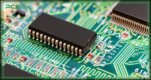

- Cada chip podia conter centenas ou milhares de transistores, tornando os computadores mais compactos e eficientes.

- A redução do tamanho dos componentes diminuiu o consumo de energia e o aquecimento, aumentando a confiabilidade.

### Características gerais
- Redução significativa do tamanho físico, permitindo que os computadores ocupassem menos espaço.

- Aumento da velocidade de processamento, possibilitando cálculos e operações mais complexas.

- Maior confiabilidade, com menos falhas em comparação às gerações anteriores.

### Memória e armazenamento
- Melhorias na RAM, com maior capacidade e velocidade.

- Avanços nos discos rígidos, permitindo armazenar mais dados e acessar informações de forma mais rápida.

- Memória e armazenamento mais eficientes suportaram programas maiores e mais complexos.

### Sistemas operacionais
- Surgem os primeiros sistemas operacionais multitarefa, permitindo que vários programas fossem executados simultaneamente.

- Isso aumentou a produtividade e a flexibilidade dos computadores.

### Exemplos de computadores
- IBM 360: um dos primeiros computadores de grande sucesso comercial, versátil para uso empresarial e científico.

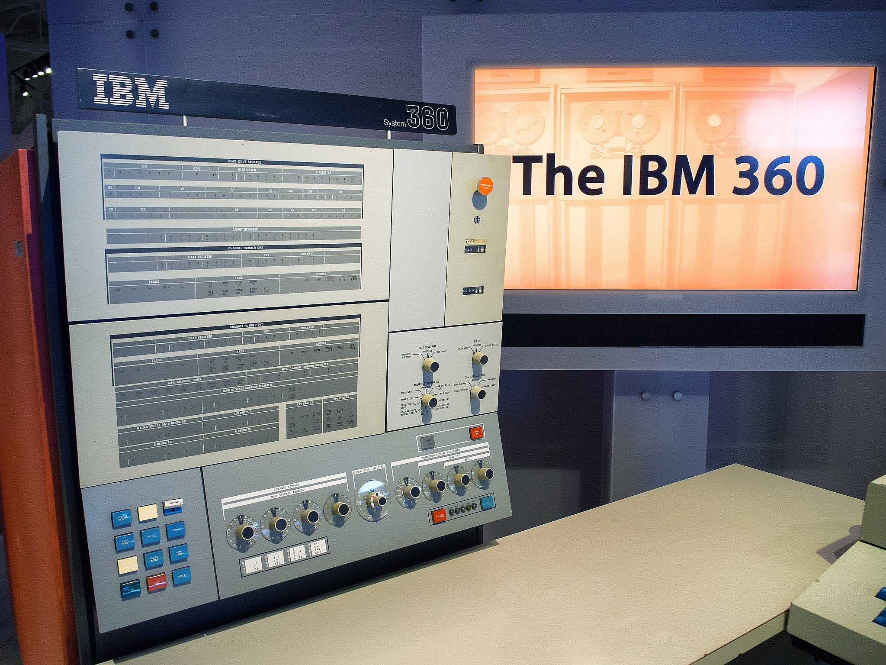

- DEC PDP-8: considerado o primeiro computador de minicomputador, mais acessível e compacto.

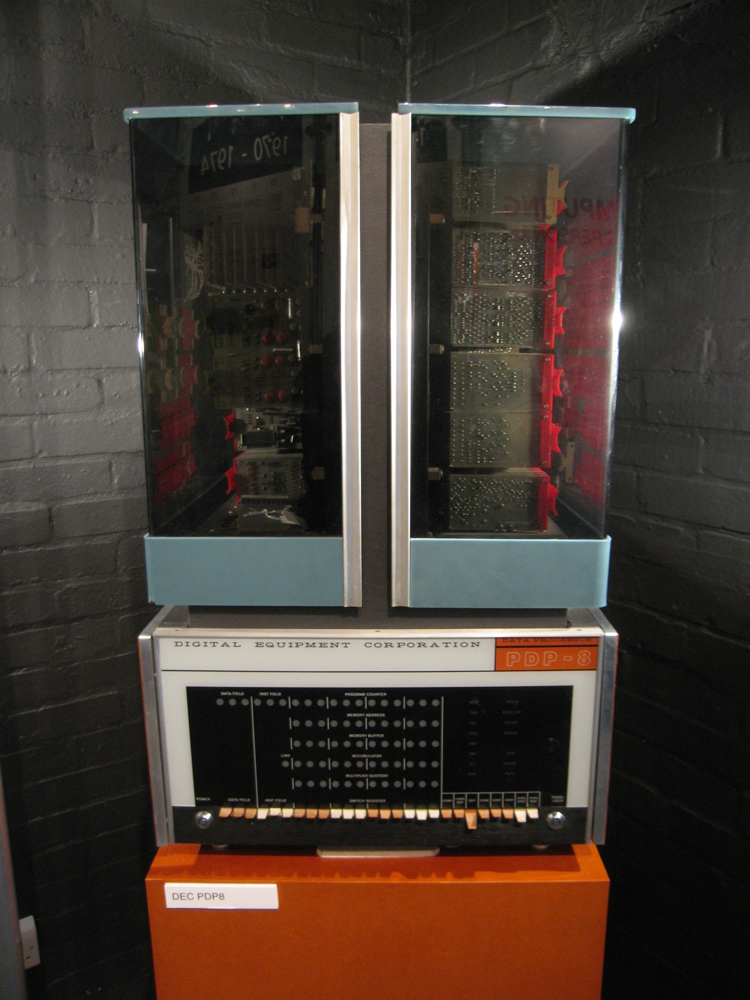

## 4 - Quarta Geração (1971–presente)
A quarta geração de computadores, iniciada em 1971 e ainda em andamento, marcou a era dos microprocessadores, permitindo a criação de computadores pessoais acessíveis e compactos.

### Tecnologia
- Os microprocessadores concentraram toda a CPU em um único chip, reduzindo drasticamente o tamanho e o custo dos computadores.

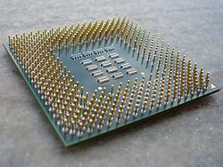

- Isso aumentou a velocidade de processamento, a eficiência energética e a confiabilidade do sistema.

### Características gerais
- Surgem os computadores pessoais (PCs), acessíveis a empresas, escolas e consumidores domésticos.

- Menor custo e tamanho reduzido possibilitam a popularização da informática.

- Computadores mais rápidos, confiáveis e fáceis de usar, prontos para tarefas cotidianas como escrita, cálculos, jogos e navegação na internet.

### Software
- Desenvolvem-se sistemas operacionais mais avançados, capazes de gerenciar múltiplas tarefas e periféricos.

- Interface gráfica (GUI) facilita a interação do usuário, tornando a computação mais intuitiva e visual.

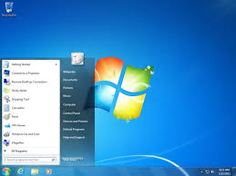

- Surgem programas de produtividade, editores gráficos, navegadores e aplicativos domésticos.

### Exemplos de computadores da Quarta Geração
- Apple II (1977)

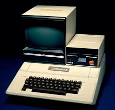

- Commodore 64 (1982)

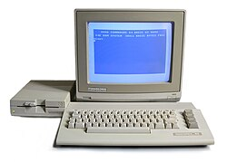

- Laptops e desktops modernos (anos 1990–presente)

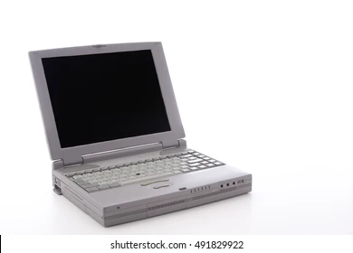

