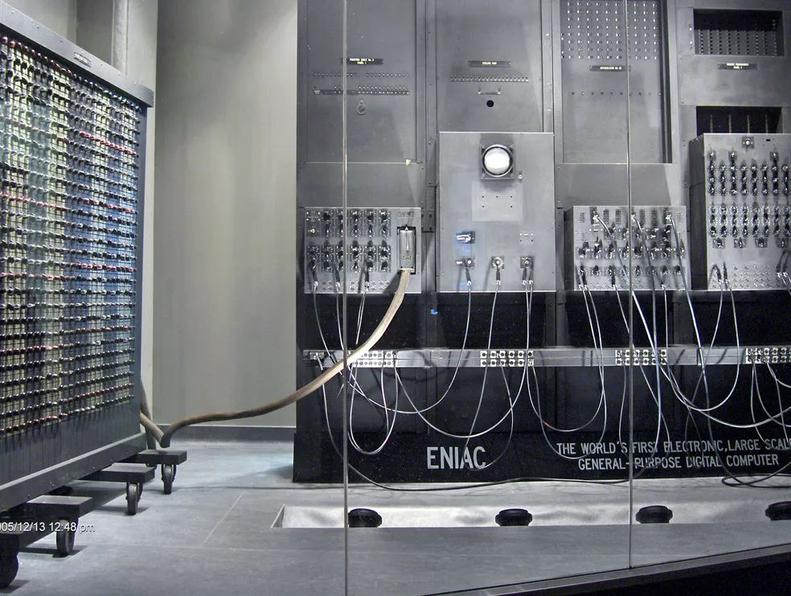
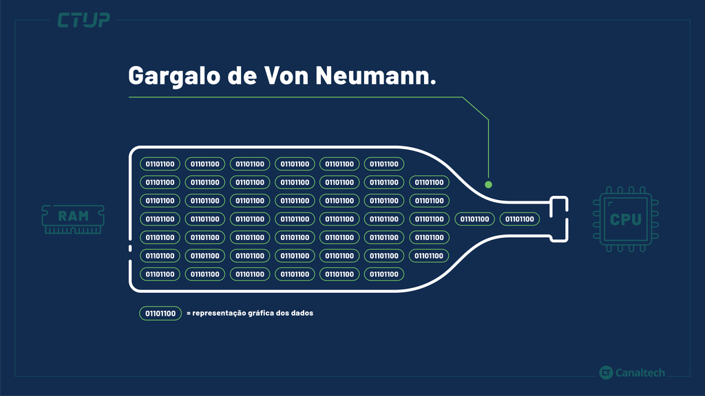
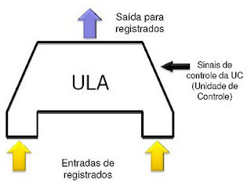
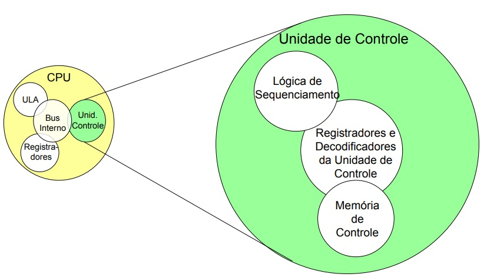

# Arquitetura de Von Neumann
A Arquitetura de Von Neumann é a base dos computadores modernos e descreve como CPU, memória e periféricos interagem através de barramentos. Entender seus componentes é essencial para compreender o funcionamento do computador e os limites dessa arquitetura.

## Introdução
A Arquitetura de Von Neumann é o modelo estrutural que serviu de base para praticamente todos os computadores modernos. Ela descreve como os principais componentes (CPU, memória e dispositivos de entrada/saída) se organizam e se comunicam para executar programas.

### O que é a Arquitetura de Von Neumann?
É um modelo computacional proposto por John von Neumann na década de 1940, cujo princípio central é que dados e instruções de programa são armazenados no mesmo espaço de memória. Isso permite que o computador leia instruções e dados usando o mesmo mecanismo, tornando o processamento mais flexível e programável.

### Conceito de Programa Armazenado
Antes desse modelo, computadores eram configurados manualmente com fios e interruptores para executar tarefas específicas.
Von Neumann revolucionou isso propondo que:

- As instruções (o programa) e os dados processados pelo programa devem ficar juntos na memória principal.

### Contexto Histórico

- Ano: Década de 1940, durante os avanços da computação pós-Segunda Guerra Mundial.

- Cenário: Computadores gigantes, baseados em válvulas, extremamente difíceis de programar.

- Contribuição de Von Neumann: criação de um documento conhecido como First Draft of a Report on the EDVAC, que descrevia pela primeira vez uma arquitetura lógica para computadores digitais programáveis.

## Gargalo de Von Neumann
Na arquitetura de Von Neumann, a memória é única: nela ficam armazenados

- os dados que o programa manipula, e
- as instruções que dizem à CPU o que fazer.

Como ambos compartilham o mesmo barramento, ocorre uma disputa natural:

- A CPU tenta buscar instruções para executar.
- A CPU também tenta buscar dados necessários para essas instruções.

Mas o barramento não consegue entregar tudo ao mesmo tempo, e isso cria um gargalo, um bloqueio que limita a velocidade do processamento.

### Consequência principal
A CPU pode ficar ociosa, esperando a memória responder.

Mesmo sendo extremamente rápida, a CPU depende da memória para continuar o processamento.
Se o fornecimento de dados e instruções é lento, a CPU literalmente para e espera, reduzindo o desempenho total do sistema.

#### Exemplo simplificado
Imagine que o barramento é uma estrada de uma única pista.
Os dados são carros.
As instruções também são carros.

Os dois precisam trafegar na mesma estrada.
Resultado: congestionamento → lentidão → gargalo.

### Impacto no desempenho
- Maior atraso para execução de programas.

- Limitação de velocidade mesmo com CPUs mais rápidas.

- Aumento do tempo total para completar tarefas complexas.

- Dificuldade para acompanhar avanços da CPU sem melhorar a memória e os barramentos.

### Soluções modernas para reduzir o gargalo
Como esse problema é estrutural, a computação moderna desenvolveu várias técnicas para “driblar” ou compensar essa limitação:

#### 1. Memória Cache

- Pequena e muito rápida.
- Fica dentro ou perto da CPU.
- Armazena instruções e dados mais utilizados.
- Reduz a necessidade de acessar a memória RAM toda hora.

Resultado: a CPU passa menos tempo esperando.

#### 2. Barramentos mais rápidos e paralelos
Ex.: DDR4/DDR5, PCIe, canais múltiplos.

Aumentam a largura de banda e diminuem o tempo de espera.

## Unidade Lógica e Aritmética (ULA/ULA)
A ULA (em português) ou ULA, Arithmetic and Logic Unit (em inglês) é um dos componentes centrais da CPU. Ela é responsável por executar todas as operações matemáticas e lógicas necessárias para que o computador funcione.

É dentro da ULA que ocorrem os cálculos e decisões que permitem que um programa avance.

### Função principal da ULA
A ULA é responsável por processar dados, realizando:

#### Operações aritméticas:

- Soma (ADD)
- Subtração (SUB)
- Multiplicação (MUL)
- Divisão (DIV)

Algumas CPUs realizam multiplicação e divisão na ULA; outras utilizam unidades específicas, mas seguem a mesma lógica: a ULA é o núcleo do cálculo.

#### Operações lógicas:
Usadas para decisões e comparações.

- AND → retorna verdadeiro se ambos os bits forem 1
- OR → retorna verdadeiro se pelo menos um bit for 1
- NOT → inverte um bit (0 vira 1, e 1 vira 0)
- XOR → verdadeiro se os bits forem diferentes

#### Comparações:
Usadas para permitir desvios e decisões dentro dos programas (if, loops).

- Igualdade (=?)
- Diferente (≠?)
- Maior que (>)
- Menor que (<)
- Maior ou igual (≥)
- Menor ou igual (≤)

Essas comparações retornam valores internos (flags), usados pela CPU para decidir o próximo passo.

### Como a ULA trabalha internamente
A ULA recebe dois tipos de entrada:

- Dados (operandos) – valores vindos da memória ou registradores
- Instruções – comandos enviados pela Unidade de Controle (UC)

A UC diz qual operação a ULA deve executar.
A ULA então realiza o cálculo e devolve o resultado para um registrador, que será usado pela CPU ou pela próxima etapa da instrução.

### Relação entre ULA e UC
A Unidade de Controle (UC) é o "cérebro organizador" da CPU, enquanto a ULA é o "braço executor".

Podemos visualizar assim:

- A UC → interpreta as instruções
- A UC → envia sinais de controle
- A ULA → executa o cálculo
- A ULA → devolve o resultado para a CPU
- A ULA nunca decide o que fazer sozinha, ela sempre age sob comando da UC.

## Unidade de Controle (UC/Control Unit)
A Unidade de Controle (UC) é a parte da CPU responsável por coordenar, organizar e sincronizar todas as operações internas do processador.
Se a ULA é o “braço” que executa cálculos, a UC é o cérebro que decide o que deve acontecer e quando.

Ela garante que cada instrução de um programa seja buscada, interpretada e executada corretamente.

### Função principal da UC
A UC controla o funcionamento da CPU como um diretor de orquestra:

- Define qual instrução será executada.

- Decide como essa instrução será executada.

- Envia sinais elétricos que ativam componentes como ULA, registradores e barramentos.

- Garante a ordem correta das operações.

Em resumo:

- A UC coordena todo o ciclo de execução das instruções.

### O que a UC faz exatamente?
#### 1. Busca de instruções na memória (Fetch)

A UC pega o endereço da próxima instrução no contador de programa (PC) e envia um comando para buscar essa instrução na memória RAM.

Depois, a instrução é armazenada no registrador de instrução (IR).

#### 2. Decodificação da instrução (Decode)

A UC interpreta o que a instrução significa:

- É uma soma?
- Uma comparação?
- Mover um dado?
- Pular para outra linha do programa?

A UC traduz a instrução em sinais de controle internos.

#### 3. Controle do fluxo de dados (Execute)

A UC envia sinais para:

- A ULA, indicando qual operação ela deve fazer.
- Os registradores, indicando de onde pegar e para onde enviar dados.
- Os barramentos, permitindo ou bloqueando a circulação de informações.

Ela coordena todo o caminho percorrido pelos dados.

#### 4. Gerência dos barramentos

Os barramentos transportam:

- dados,
- endereços,
- sinais de controle.

A UC é quem decide:

- qual dispositivo usa o barramento naquele instante;
- quando a memória deve enviar dados;
- quando a ULA deve escrever resultados;
- quando um dispositivo de E/S deve comunicar-se.

Sem essa coordenação, os dispositivos "falariam ao mesmo tempo" e o sistema entraria em conflito.

## Memória
A memória tem a função de guardar tudo o que o computador precisa para funcionar, incluindo:

- instruções do programa (código a ser executado)
- dados que o programa irá manipular
- valores temporários usados durante o processamento
- endereços e ponteiros
- informações do sistema operacional

A CPU acessa essa memória constantemente para buscar instruções e manipular dados.

### Tipos de memória na arquitetura

#### Memória Principal (RAM)
É a memória de trabalho do computador.

- Volátil (perde dados quando o PC desliga).
- Muito rápida.
- Utilizada para armazenar dados temporários e instruções em execução.

A CPU acessa a RAM várias vezes por segundo.

#### Memória ROM
(Read-Only Memory)

- Não volátil.
- Armazena instruções permanentes, como o firmware ou o sistema de boot.
- Geralmente não pode ser alterada pelo usuário.

Embora a ROM não seja tão usada durante o processamento normal, ela é fundamental para iniciar o sistema.

### Relação com o Gargalo de Von Neumann
O fato de dados e instruções compartilharem a mesma memória cria um problema:

#### A CPU só pode buscar uma coisa por vez:
- ou dados
- ou instruções

E como a CPU é muito mais rápida do que a memória, ela frequentemente fica esperando a memória responder.

Isso reduz o desempenho geral do sistema.

#### Consequências:

- atrasos na execução
- limitação de velocidade
- necessidade de técnicas como cache, pipeline, prefetch etc.

## Barramentos
Definir: vias de comunicação internas que conectam CPU, memória e periféricos.

Tipos principais:

Barramento de dados – transporte de informações.

Barramento de endereço – indica onde os dados devem ser lidos ou escritos.

Barramento de controle – sinais de comando e sincronização.

Importância: eficiência do fluxo de informações entre componentes.

## Ciclo de Instrução (opcional para estudo)
Explicar como a UC e ULA interagem com a memória e barramentos durante o ciclo:

Busca (Fetch) – a instrução é lida da memória.

Decodificação (Decode) – UC interpreta a instrução.

Execução (Execute) – ULA processa dados.

Armazenamento (Store) – resultado é gravado na memória ou registradores.

## Barramentos
Os barramentos são conjuntos de vias (fios, trilhas elétricas ou linhas digitais) responsáveis por transportar informações dentro do computador.
Eles fazem a comunicação entre a CPU, a memória e os dispositivos de entrada/saída, garantindo que todos os componentes possam trocar dados de forma organizada.

Pense nos barramentos como estradas internas pelas quais os dados e comandos circulam.

### O que são barramentos?
Barramentos são canais de comunicação que permitem que diferentes partes do sistema transfiram informações.

Eles carregam três tipos de conteúdo:

- Dados
- Endereços
- Sinais de controle

Cada tipo de informação usa um barramento próprio, porque eles têm finalidades distintas.

### Tipos principais de barramentos
#### 1. Barramento de Dados
Transporta os dados propriamente ditos.
Pode ser:

- valores numéricos,
- instruções,
- resultados de cálculos,
- qualquer informação que circule entre memória, CPU e periféricos.

A largura do barramento (8 bits, 16 bits, 32 bits, 64 bits) determina quantos bits podem ser transmitidos simultaneamente — e isso influencia diretamente a velocidade.

#### 2. Barramento de Endereços
Indica onde os dados devem ser lidos ou escritos.

Exemplos:

- "CPU → RAM: acesse o endereço 0x0000F120"
- "CPU → SSD: escreva no bloco X"

A largura desse barramento determina o máximo de memória que o sistema consegue endereçar.
Exemplo:

Barramento de 32 bits → até 4 GB de endereçamento direto

Barramento de 64 bits → até 16 exabytes teóricos

#### 3. Barramento de Controle
Transporta sinais de comando, como:

- Read (leitura)
- Write (escrita)
- Clock (sincronização)
- Interrupt (interrupções)
- Reset (reinicialização)
- Enable/Disable

É o barramento que coordena e sincroniza o funcionamento dos outros dois.
Sem ele, a CPU não conseguiria dizer à memória o que fazer e quando fazer.

