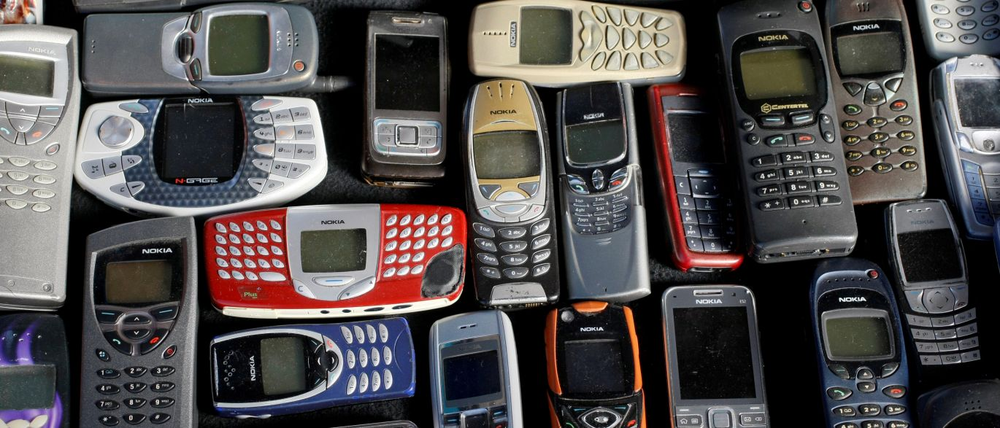
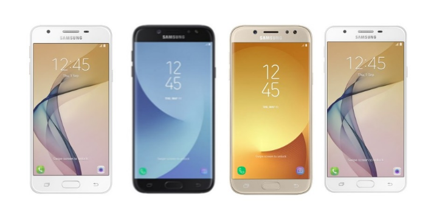
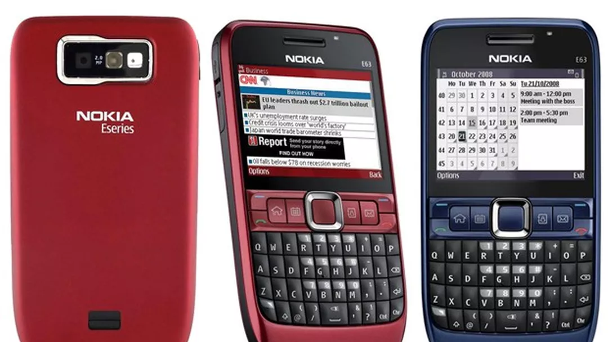
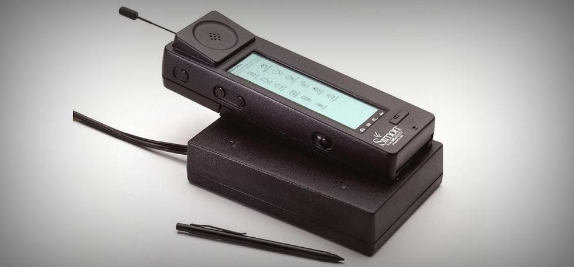
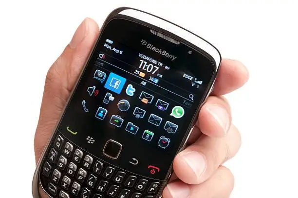
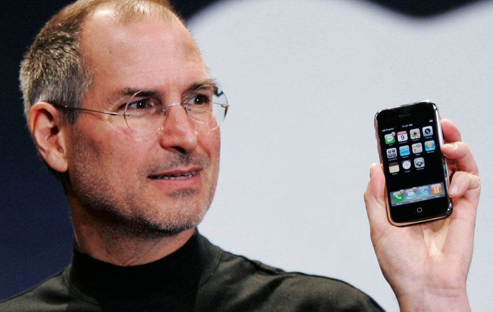

# Evolução dos Smartphones

## Fundamentos: Antes dos Smartphones
Antes dos smartphones existirem, muito antes de termos touchscreens, câmeras avançadas ou lojas de aplicativos, houve uma longa evolução dos telefones celulares, passando por várias etapas tecnológicas que prepararam o terreno para o que chamamos hoje de telefone inteligente.

### Celulares analógicos e digitais
A grande transformação ocorreu quando a comunicação celular deixou de ser analógica (1G) e passou a ser digital (2G).

#### Celulares Analógicos

- Usavam modulação analógica.
- Eram lentos, inseguros e com alto ruído.
- Difíceis de miniaturizar.
- Sem suporte para dados (somente voz).

#### Celulares Digitais

- Utilizavam modulação digital (como GSM e CDMA).
- Mais qualidade de chamada.
- Menos interferência.
- Permitir a transmissão de dados (SMS, MMS).
- Equipamentos ficaram menores, mais baratos e mais eficientes.
- Essa transição foi essencial para a ideia de “telefone + computador” surgir.

### A virada dos “feature phones”
Os feature phones foram o elo de transição entre celulares simples e smartphones modernos.

Eles se destacavam por:

- Câmeras básicas
- Jogos embutidos
- MP3
- Radios FM
- Navegação WAP (internet super limitada)
- Calendário, agenda e poucos aplicativos nativos
- Alguns até tinham teclado QWERTY (ex.: Nokia E63)

Tudo isso criou o ambiente ideal para que, em 2007, o iPhone redefinisse o mercado e desse início à era moderna dos smartphones.

## Primeira Geração de Smartphones (1990–2006)
Entre 1990 e 2006, surge uma variedade de aparelhos experimentais que misturavam funções de comunicação, agenda digital, e alguns recursos de computador.
Eles não pareciam com smartphones modernos, mas introduziram conceitos fundamentais como:

- touchscreen,
- e-mail móvel,
- aplicativos,
- organizadores,
- sistemas operacionais avançados.

### IBM Simon (1994) – O Primeiro Smartphone da História
O IBM Simon Personal Communicator é reconhecido como o primeiro smartphone oficial.

Principais características:

- Lançado em 1994.
- Tela touchscreen resistiva (usando stylus).
- Sistema operacional próprio da IBM.
- Funções além de telefone:
    - calendário
    - agenda
    - bloco de notas
    - calculadora
    - e-mail
    - fax (!)
    - aplicativos básicos instaláveis
- Pesado, lento, e com bateria fraca — mas revolucionário.

### BlackBerry – E-mail móvel e teclados físicos
A partir dos anos 2000, os dispositivos BlackBerry, da RIM, tornaram-se referência em smartphones corporativos.

Destaques:

- Teclado QWERTY físico altamente funcional.
- Enfase em e-mail em tempo real, principalmente com o serviço BlackBerry Internet Service.
- Segurança avançada.
- Bateria excelente.
- Interface pensada para produtividade.

Para muitas pessoas, BlackBerry era sinônimo de smartphone antes do iPhone.

### Resumo Geral da Primeira Geração (1990–2006)

| Categoria                        | Exemplos                 | Contribuições                               |
| -------------------------------- | ------------------------ | ------------------------------------------- |
| **Primeiro smartphone**          | IBM Simon                | Touchscreen, apps básicos, agenda integrada |
| **E-mail e produtividade**       | BlackBerry               | Teclado físico, push e-mail                 |
| **PDAs híbridos**                | Palm Treo                | Apps, agenda, stylus, telefone integrado    |
| **Sistema operacional avançado** | Symbian / Nokia N-series | Multimídia, apps, internet                  |
| **Computação portátil**          | Windows Mobile           | Office móvel, multitarefa                   |

## A Virada de 2007: iPhone e a Nova Era
Em 2007, a Apple lançou o primeiro iPhone, e esse momento é considerado uma das maiores revoluções tecnológicas da história moderna.

Não foi apenas mais um smartphone, foi uma mudança de paradigma, redefinindo interface, design, ecossistema e forma de interação humana com dispositivos móveis.

### Lançamento do iPhone original (2007)
No dia 9 de janeiro de 2007, Steve Jobs apresentou o iPhone como “um iPod widescreen com controles por toque, um telefone revolucionário e um comunicador de internet”, três produtos em um só.

#### Características do primeiro iPhone:

- Tela multitouch capacitiva de 3.5” (sem stylus)
- Navegação web real (Safari)
- iOS (na época, chamado apenas de “iPhone OS”)
- Interface simples e fluida
- Armazenamento de 4–8 GB
- Sem teclado físico
- Design totalmente em vidro e alumínio

Nada parecido existia no mercado.

### App Store (2008) e a economia dos apps

A primeira versão do iPhone (2007) não tinha App Store, só aplicativos nativos.

Mas em 2008, a Apple lançou a App Store, e isso mudou tudo:

#### Por que a App Store foi revolucionária?
- Criou a economia dos aplicativos.
- Permitiu que desenvolvedores independentes criassem apps.
- Trouxe segurança e padronização.
- Gerou um ecossistema global.
- Transformou smartphones em ferramentas infinitamente expansíveis.

Hoje, apps movimentam bilhões de dólares e são essenciais no cotidiano, essa transformação começou aqui.

#### Mudança de paradigma: do teclado físico para telas totalmente touch

Antes do iPhone:

- BlackBerry dominava com teclados físicos.
- Palm e Windows Mobile também dependiam de stylus.
- A interface era pensada para "cliques" e menus hierárquicos.

O iPhone mostrou que:
- o teclado poderia aparecer apenas quando necessário
- uma interface baseada em gestos era mais natural
- o espaço do telefone deveria ser quase totalmente tela
- a navegação deveria ser fluida e visual

Essa mudança fez gigantes da época repensarem tudo, inclusive o Google, que redesenhou o Android após ver o iPhone.

** STYLUS: é um pequeno objeto em formato de caneta usado para interagir com a tela de dispositivos

## Ascensão do Android (2008–2012)
Entre 2008 e 2012, o Android saiu do zero para se tornar o sistema operacional móvel mais utilizado do mundo.
Essa ascensão rápida não foi por acaso, ela envolveu estratégias técnicas, comerciais e uma filosofia aberta que atraiu fabricantes e consumidores.

### Lançamento do Android e do HTC Dream (2008)
O Android foi criado originalmente pela startup Android Inc., comprada pelo Google em 2005.
O sistema foi oficialmente lançado em 2008, junto com o primeiro smartphone Android:

#### HTC Dream (também chamado T-Mobile G1)

- Teclado físico deslizante
- Tela sensível ao toque
- Android 1.0
- Integração total com serviços Google (Gmail, Maps, YouTube)
- Android Market (o precursor do Google Play)

O HTC Dream não tinha o refinamento do iPhone, mas apresentava características inovadoras para o público técnico, como widgets e multitarefa rudimentar.

### Android como sistema aberto (open source)
A principal força do Android era (e ainda é): ele é um sistema operacional aberto.

Por que isso importa?
- O Google disponibilizou o Android gratuitamente (sob o projeto AOSP – Android Open Source Project), permitindo que:

- qualquer fabricante pudesse usar o sistema
- customizações fossem feitas livremente
- o SO fosse adaptado para diferentes tamanhos de tela
- a concorrência no mercado aumentasse
- o preço dos dispositivos caísse significativamente

### Expansão de fabricantes (Samsung, Motorola, LG, Sony, Xiaomi)
Graças ao caráter open source, inúmeras marcas adotaram o Android:

- Samsung
- Motorola
- LG e Sony
- Xiaomi (a partir de 2011)

### iPhone x Android

iPhone (iOS):

- maior refinamento
- experiência controlada
- ecossistema fechado e integrado
- foco em qualidade, não quantidade

Android:

- muitos modelos para todos os bolsos
- customização total
- recursos avançados primeiro (widgets, multitarefa, tethering)
- diversidade de hardware
