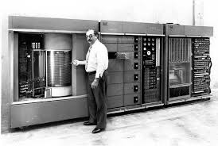
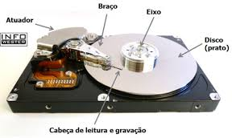
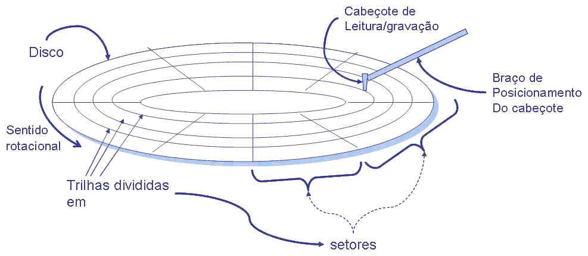
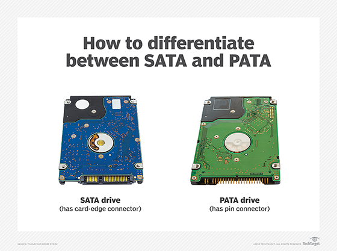

# HD (Hard Disk Drive)

## História do HD
A história dos HDs acompanha diretamente a evolução do armazenamento magnético e da computação moderna. Seu objetivo sempre foi o mesmo: guardar o máximo de dados possível pelo menor custo, mas sua tecnologia mudou drasticamente ao longo das décadas.

### 1956 — O Nascimento: IBM 305 RAMAC
O primeiro HD da história foi introduzido em 1956, com o sistema IBM 305 RAMAC (Random Access Method of Accounting and Control).

#### Características marcantes:

- Capacidade: 5 MB (equivalente a algumas fotos atuais)
- Peso: quase 1 tonelada
- Tamanho: do tamanho de dois refrigeradores industriais
- Internamente: continha 50 discos (platters) metálicos enormes
- Velocidade: extremamente lenta se comparada a HDs modernos

Apesar do tamanho, a capacidade de acessar dados aleatoriamente, em vez de enrolar fita magnética — foi revolucionária.

### Décadas de 1960 a 1980 — Miniaturização e Primeiros Usos em Computadores
Nos 20–30 anos seguintes, a tecnologia evoluiu, porém devagar, principalmente por limitações mecânicas e alto custo.

#### O que aconteceu nesse período:

- HDs ainda eram extremamente caros — usados apenas em empresas e centros de pesquisa.
- Iniciou-se um processo de miniaturização, mas ainda eram grandes.
- Começaram a surgir em mainframes e, mais tarde, nos primeiros computadores pessoais.
- Tecnologias de leitura/escrita melhoraram, mas ainda sem padronização.

### Anos 1990 — Popularização, Padrões e Era dos PCs
Foi na década de 90 que os HDs realmente chegaram ao grande público.

#### Características da era:

- Popularização nos PCs domésticos
- Capacidades crescendo de 40 MB → 120 MB → 500 MB → 1 GB ao longo da década
- Queda de preço: ficou acessível montar PCs com HD
- Surgimento e padronização de duas interfaces importantes:
- IDE (ou ATA) — usada em PCs domésticos
- SCSI — usada em servidores (maior desempenho)

### Anos 2000 — Expansão Exponencial e Domínio do SATA

A partir dos anos 2000, os HDs entraram em uma fase de crescimento acelerado.

#### Principais marcos:

- Capacidades saltaram rapidamente de 20 GB → 80 GB → 160 GB → 500 GB → 1 TB
- A tecnologia de gravação magnética evoluiu (gravação perpendicular)
- Surgiu o padrão SATA, substituindo o IDE:
- Cabos mais finos
- Transferências mais rápidas
- Melhor suporte a hot-swap (em servidores)

Resultado:
- O HD se tornou um componente universal em PCs, notebooks e servidores.
- A produção aumentou globalmente, diminuindo custos.
- Surgiram linhas especializadas (para notebook, desktop, servidores).

## Estrutura do HD
Para entender como um HD funciona, é importante conhecer seus componentes internos, que trabalham juntos para ler e gravar dados usando magnetismo. Um HD é uma peça de engenharia extremamente precisa, com partes que operam na escala de nanômetros.

### 1. Pratos (Platters)
São discos circulares de alumínio, vidro ou cerâmica, altamente polidos.
Eles ficam empilhados dentro do HD e são onde os dados realmente são armazenados.

#### Características:
- Recobertos por uma camada magnética.
- Giram em alta velocidade (5.400, 7.200, 10.000 RPM).
- Cada prato possui duas faces graváveis.

Quanto mais pratos, maior a capacidade do HD.

### 2. Camada Magnética
É a superfície especial dos pratos onde os bits são representados.

#### Como funciona:
- Um bit é armazenado por meio da orientação magnética de partículas microscópicas.
- Pequenas áreas magnetizadas → representam 0 ou 1.
- A tecnologia evoluiu de gravação longitudinal → gravação perpendicular (mais densa).

### 3. Cabeças de Leitura/Escrita (Read/Write Heads)
São minúsculos sensores magnéticos responsáveis por:

- Ler o magnetismo do prato
- Escrever alterando o magnetismo da superfície

#### Particularidades:
- Cada face do prato tem sua própria cabeça.
- Elas não encostam no prato.
- Flutuam a nanômetros da superfície devido ao colchão de ar formado pela rotação.

Qualquer poeira ou choque pode fazer a cabeça tocar o prato → “head crash” → dano permanente.

### 4. Atuador (Actuator Arm)
É o braço mecânico que movimenta as cabeças de leitura/escrita.

#### Funções:
- Deslocar as cabeças com movimento extremamente rápido e preciso.
- Posicionar as cabeças sobre a trilha correta onde o dado está.

#### Como funciona:
- O movimento costuma ser feito por um atuador por bobina de voz (voice coil), semelhante ao alto-falante.
- Movimentos precisos garantem leitura/gravação correta.

Trabalha coordenado com sensores e a placa PCB para manter precisão de micrômetros.

### 5. Motor de Rotação (Spindle Motor)
É o motor que gira os pratos.

#### Características:
- Mantém rotações constantes (RPM fixos).
- Pode girar a 5.400 rpm, 7.200 rpm, 10.000 rpm ou mais (servidores).
- Quanto maior a velocidade, menor o tempo para encontrar dados.

A estabilidade desse motor é fundamental — vibrações podem corromper a leitura.

## Gravação e Leitura de Dados
### Funcionamento Magnético

O HD armazena informações usando magnetismo:
- Cada bit (0 ou 1) é representado pela orientação magnética de partículas na superfície do prato.
- Não há luz, nem eletricidade direta no prato — tudo é feito por campos magnéticos.

### Trilhas, Setores e Cilindros
Para organizar os dados, o disco é dividido em:

- Trilha: um círculo completo no prato.
- Setor: um pedaço da trilha (menor unidade endereçável).
- Cilindro: conjunto de trilhas alinhadas verticalmente em todos os pratos.

Essa estrutura ajuda o HD a localizar dados rapidamente.

### Processo de Leitura

1 - Motor gira os pratos em alta velocidade.

2 - Atuador posiciona a cabeça exatamente na trilha onde o dado está.

3 - A cabeça de leitura detecta mudanças no magnetismo da superfície.

4 - A placa controladora (PCB) converte esses sinais analógicos em dados digitais (0 e 1).

### Processo de Gravação

- O atuador leva a cabeça até a trilha correta.
- A cabeça cria um campo magnético que altera a polaridade da superfície.
- Cada alteração representa um bit gravado.

## RAID e seus Tipos
RAID é uma técnica que combina vários HDs para melhorar desempenho, segurança ou ambos.

### RAID 0 – Striping
- Divide os dados entre os discos.
    - Prós: velocidade máxima.
    - Contras: zero segurança — se 1 disco falhar, tudo se perde.

Uso: jogos, edição de vídeo, sistemas temporários.

### RAID 1 – Mirroring
Um disco espelha o outro.
- Prós: alta segurança (backup imediato).
- Contras: dobra o custo (capacidade total cai pela metade).

Uso: servidores pequenos, ambientes críticos.

### RAID 5 – Paridade Distribuída
Precisa de 3 discos.

- Prós: segurança + melhor aproveitamento do espaço.
- Contras: reconstrução lenta se um disco falha.

Uso: servidores e storages empresariais.

### RAID 6 – Dupla Paridade
Semelhante ao RAID 5, mas suporta falha de 2 discos.

- Prós: segurança máxima sem espelhamento total.
- Contras: desempenho menor e mais discos necessários.

Uso: grandes servidores e sistemas críticos.

### RAID 10 (1+0)
Combina striping (RAID 0) + mirroring (RAID 1).

- Prós: alta velocidade + alta segurança.
- Contras: muito caro (metade da capacidade útil).

Uso: bancos de dados, operações intensivas.

## Tipos de HD (por Interface / Tecnologia)

### IDE / PATA (Parallel ATA)

- Antiga interface paralela.
- Cabos largos de 40/80 vias.
- Velocidades baixas (até ~133 MB/s).
- Usada antes de 2005.

### SATA (Serial ATA)
Interface mais comum em PCs e notebooks.

- Cabos finos e simples.
- Velocidades:
    - SATA I: 1.5 Gb/s
    - SATA II: 3 Gb/s
    - SATA III: 6 Gb/s
- Usada em HDs mecânicos e alguns SSDs 2.5".

### SCSI (Small Computer System Interface)

- Interface antiga profissional/servidores.
- Alta durabilidade e velocidade (para sua época).
- Precursora do SAS.

