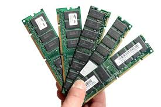
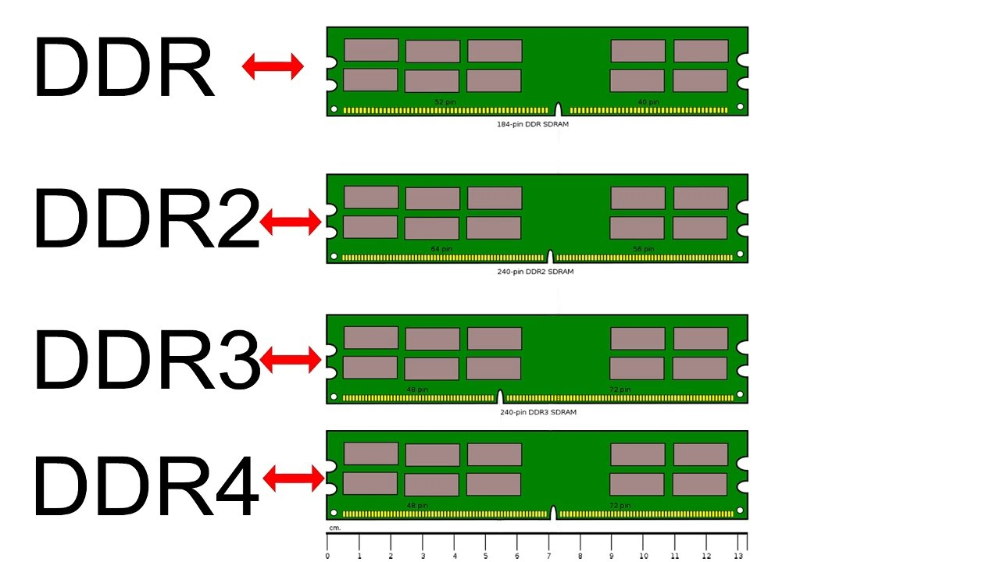
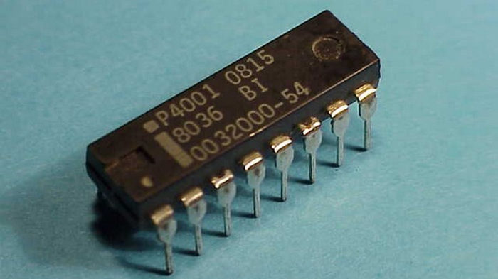
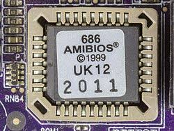

# RAM e ROM — explicação completa

## Visão geral (alto nível)
Memória é qualquer componente que armazena dados e instruções para que o processador (CPU) e outros blocos do sistema possam usá-los.

Em arquitetura de computadores, distinguimos duas grandes classes por comportamento e função:

- RAM (Random-Access Memory) — memória volátil usada como espaço de trabalho do sistema (lendo e escrevendo com alta frequência).

- ROM (Read-Only Memory) — memória não-volátil que guarda dados persistentes ou firmware, típicos para inicialização e instruções fixas.

## RAM (Random Access Memory)

### O que é e qual o papel

- RAM é a memória principal do sistema: armazena o sistema operacional, programas em execução e os dados que esses programas manipulam em tempo de execução.

- É chamada random-access porque qualquer célula de memória pode ser acessada em tempo (aproximadamente) constante, independentemente da posição.

### Volatilidade
- Volátil: perde o conteúdo quando a energia é removida. (Exceto variantes especiais com backup de bateria.)

### Tecnologias principais

- SRAM (Static RAM)
    - Implementada com flip-flops (transistores), tipicamente 6 transistores por bit.
    - Muito rápida, sem necessidade de refresh.
    - Alto custo por bit → usada em cache (L1, L2, às vezes L3 parcial).

- DRAM (Dynamic RAM)
    - Cada bit = um transistor + um capacitor.
    - Capacitor armazena carga que representa 1/0; precisa ser refreshado periodicamente porque a carga se dissipa.
    - Muito denso e barato por bit → usada como memória principal (RAM).
    - Variações: SDRAM → DDR (DDR, DDR2, DDR3, DDR4, DDR5) — protocolos síncronos e melhorias em taxa e eficiência.

## ROM (Read Only Memory)

### O que é e papel
- ROM é memória não-volátil cujo conteúdo persiste sem energia. Usada para firmware, bootloader, microcódigo, tabelas fixas e dados imutáveis.
- Em sistemas modernos, ROM frequentemente contém BIOS/UEFI, microcódigo inicial e rotinas de inicialização.

### Tipos de ROM e comportamento
- Mask ROM: conteúdo gravado na fabricação; imutável. Uso antigo para firmware fixo.
- PROM (Programmable ROM): pode ser programada uma vez pelo usuário com dispositivo específico.
- EPROM (Erasable PROM): pode ser apagada com exposição a UV e reprogramada.
- EEPROM (Electrically Erasable PROM): apagável e reprogramável eletricamente, byte-a-byte.
- Flash memory (NOR / NAND): forma moderna de EEPROM, permite apagar blocos maiores; usado em BIOS (flash NOR) e armazenamento (NAND).
    - NOR Flash: acesso aleatório, executável in-place (XIP) em algumas arquiteturas → bom para código de boot/firmware.
    - NAND Flash: otimizado para densidade e custo, usado em SSDs e armazenamento em massa.

### ROM no PC moderno: BIOS / UEFI
- O firmware (BIOS antigo ou UEFI moderno) fica em Flash ROM na placa-mãe.
- Funções: POST (Power On Self Test), inicialização de dispositivos, bootstrap do carregador do SO, configuração de hardware.
- UEFI substitui BIOS com interface mais rica, suporte a discos GPT, drivers em modo nativo, secure boot.

