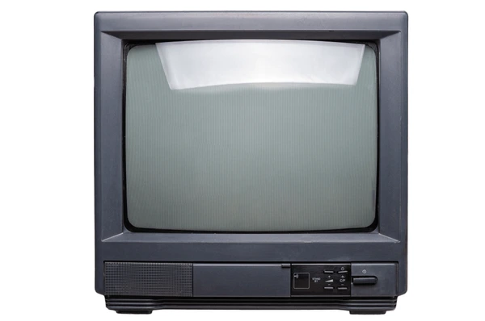
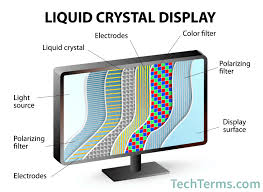
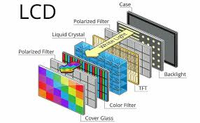
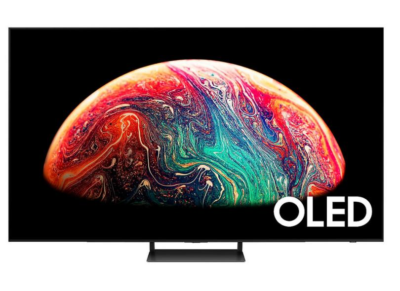
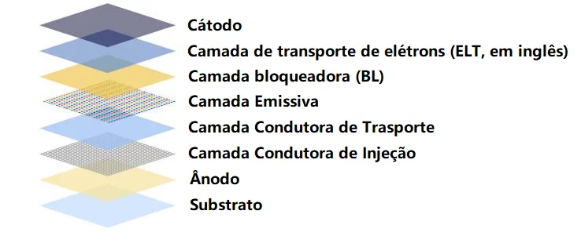

# Monitores de Computador — Guia Completo

## Informações Importantes
Antes de estudar tipos e tecnologias, entenda os pilares principais:

- Um monitor converte sinais elétricos em luz (imagem).
- Ele usa painéis, tecnologias de iluminação, taxas de atualização e resolução para formar a imagem.
- Quanto mais moderna a tecnologia, melhor a fidelidade visual, contraste, brilho e consumo de energia.
- Cada geração de monitor melhora nitidez, velocidade, cores e eficiência.

## Evolução dos Monitores
### CRT (Cathode Ray Tube / Tubo de Raios Catódicos)
Como funcionava: um tubo de vidro enorme onde elétrons eram disparados contra fósforos na tela.

- Grande, pesado, profundo.
- Suporte nativo a taxas de atualização altas (100–160 Hz).
- Ótimo preto, mas baixa nitidez.

### LCD (Liquid Crystal Display)
Como funciona: moléculas de cristal líquido controlam a passagem de luz da iluminação traseira.

- Primeira geração de monitores “finos”.
- Dependem de luz traseira (CCFL antigamente, LED hoje).
- Eficiência muito maior que CRT.

### OLED (Organic Light Emitting Diode)
Funcionamento: cada pixel emite sua própria luz (não precisa de backlight).

- Preto perfeito → contraste infinito.
- Cores vivas.
- Risco de burn-in.

### QLED, Mini-LED e Micro-LED

**QLED**: LCD com camada de Quantum Dots que melhora cor e brilho.

**Mini-LED**: LCD com backlight dividido em mini LEDs (mais zonas de dimming).

**Micro-LED**: pixels formados por LEDs microscópicos individuais → como OLED, mas sem burn-in.

### Principais Tecnologias (Tabela Completa)
Tecnologia x Princípio x Vantagem x Desvantagem

| Tecnologia         | Princípio de Funcionamento                                 | Vantagens                                             | Desvantagens                           |
| ------------------ | ---------------------------------------------------------- | ----------------------------------------------------- | -------------------------------------- |
| **CRT**            | Feixe de elétrons atinge fósforo no vidro                  | Ótimo contraste, sem blur, altas taxas de atualização | Pesado, grande, consumo alto, obsoleto |
| **LCD (CCFL/LED)** | Cristais líquidos modulam luz do backlight                 | Fino, leve, barato, eficiente                         | Preto fraco, contraste limitado        |
| **OLED**           | Cada pixel emite sua própria luz                           | Preto perfeito, cores vibrantes, ângulos perfeitos    | Burn-in, preço alto                    |
| **QLED**           | LCD + Quantum Dots para cor melhor                         | Muito brilho, bom para HDR                            | Ainda depende de backlight             |
| **Mini-LED**       | LCD com LEDs muito pequenos criando zonas de escurecimento | Contraste muito melhor, brilho altíssimo              | Ainda pode ter “blooming”              |
| **Micro-LED**      | Cada pixel é um LED individual                             | Sem burn-in, brilho alto, preto perfeito              | Extremamente caro, ainda raro          |

