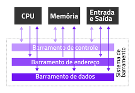

# Barramentos — O que são e como funcionam

## O que é um barramento?
Um barramento (bus) é um conjunto de linhas elétricas ou vias de comunicação que permite a troca de dados entre os componentes de um computador.

Ele funciona como uma estrada interna, por onde trafegam:

- Dados
- Endereços
- Sinais de controle

Ou seja, ele conecta CPU, memória, dispositivos de entrada/saída, placa-mãe, controladores, etc.

Sem barramentos, os componentes seriam “ilhas isoladas”.

## Tipos de Barramentos (Arquitetura clássica)
Os barramentos tradicionais são divididos em três grandes categorias:

### 1. Barramento de Dados (Data Bus)
Transporta os dados brutos que circulam entre CPU, memória e dispositivos.

#### Características

- Bidirecional (CPU pode enviar e receber).
- Largura é medida em bits: 8, 16, 32, 64 bits...
- Quanto maior a largura → mais dados trafegam de uma vez.

#### Importância

- Define o tamanho máximo de informação por ciclo.

Ex.: CPU de 64 bits → barramento de dados de 64 bits.

### 2. Barramento de Endereço (Address Bus)
Indica onde os dados devem ser lidos ou gravados na memória.

#### Características

- É unidirecional (da CPU → memória/dispositivo).
- Define o máximo de memória endereçável.

#### Exemplo

- Barramento de endereço de 32 bits → suporta 4 GB de RAM
- Barramento de 64 bits → suporta 16 exabytes (não usado totalmente na prática)

### 3. Barramento de Controle (Control Bus)
Transporta sinais de comando e sincronização, como:

- Read (ler)
- Write (escrever)
- Clock
- Interrupções (IRQ)
- Sinais de reset
- Sinais de estado

#### Características

- Coordena quando e como o barramento de dados e endereço funcionarão.

## Tabela — Tipos de Barramentos Modernos

| Barramento                                  | Função                            | Velocidade / Largura                                                                      | Uso Típico                    | Vantagens                       | Desvantagens                    |
| ------------------------------------------- | --------------------------------- | ----------------------------------------------------------------------------------------- | ----------------------------- | ------------------------------- | ------------------------------- |
| **PCI** (Peripheral Component Interconnect) | Conectar periféricos internos     | Até 133 MB/s                                                                              | Placas antigas                | Simples, compatível             | Muito lento                     |
| **PCI Express (PCIe)**                      | Conexão serial de alta velocidade | De x1 a x16                                                                               | GPU, SSD NVMe, placas de rede | Altíssima velocidade, escalável | Preço maior                     |
| **AGP** (antigo)                            | Dedicado para vídeo               | 266–2133 MB/s                                                                             | GPUs antigas                  | Otimizado para gráficos         | Obsoleto                        |
| **ISA** (muito antigo)                      | Periféricos básicos               | Até 8 MB/s                                                                                | PCs antigos                   | Simples                         | Muito lento e ultrapassado      |
| **SATA**                                    | Conexão de armazenamento          | 1.5–6 Gb/s                                                                                | HDs e SSDs SATA               | Compatível, barato              | Limitado para SSDs modernos     |
| **SCSI / SAS**                              | Armazenamento profissional        | Até 12 Gb/s                                                                               | Servidores                    | Alta confiabilidade             | Custo alto                      |
| **USB**                                     | Entrada/saída universal           | USB 2.0 → 480 Mb/s USB 3.0 → 5 Gb/s USB 3.2 → 20 Gb/s USB4/Thunderbolt → 40 Gb/s | Dispositivos externos         | Plug and play, versátil         | Difícil padronização de versões |
| **Thunderbolt**                             | E/S de alta velocidade            | Até 40 Gb/s                                                                               | Dock, SSD externo             | Extremamente rápido             | Uso mais restrito               |
| **Front-Side Bus (FSB)**                    | Comunicação CPU ↔ chipset         | Variável                                                                                  | CPUs antigas da Intel         | Simples                         | Substituído pelo QPI            |
| **QPI / DMI**                               | Link moderno CPU ↔ chipset        | Alta banda                                                                                | CPUs atuais                   | Alta performance                | Proprietário                    |

