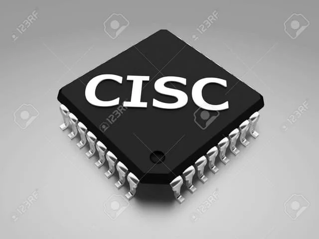
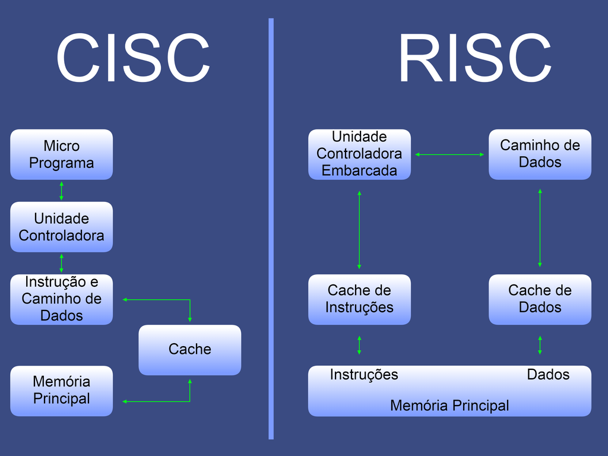
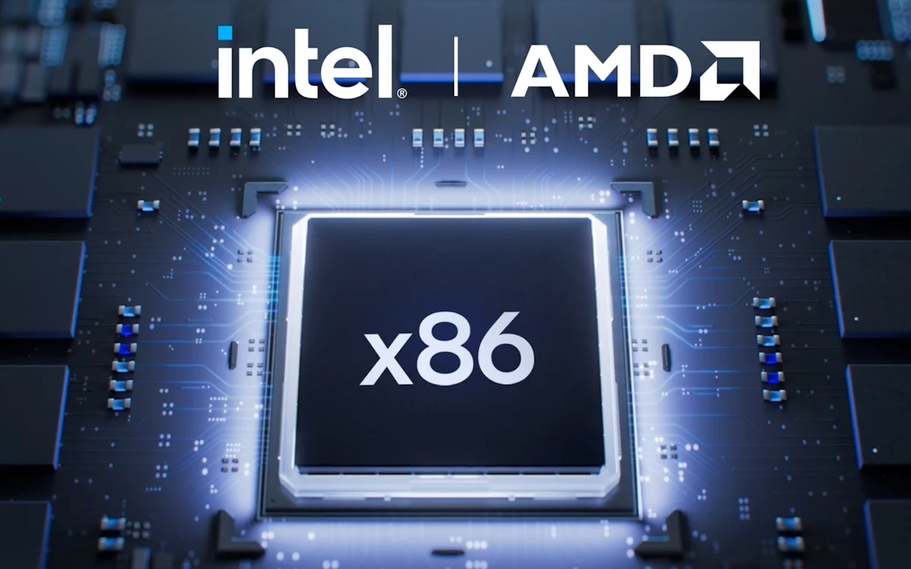

# CISC (Complex Instruction Set Computer)
Arquitetura com grande conjunto de instruções, muitas delas complexas.

Uma única instrução pode fazer múltiplas operações (ex.: acessar memória, calcular e armazenar o resultado).

- Objetivo histórico: diminuir o número de instruções necessárias em um programa.
- Consequência: hardware mais complexo e instruções mais lentas, porque precisam ser interpretadas por microcódigo.
- Filosofia: “por que usar várias instruções simples, se posso usar uma instrução poderosa que faz tudo?”.

# RISC (Reduced Instruction Set Computer)
Arquitetura com poucas instruções, todas simples e geralmente executadas em um único ciclo.

- Instruções de tamanho fixo, facilitando decodificação e pipeline.
- Controle feito diretamente no hardware (hardwired, sem microcódigo).
- Filosofia: simplificar o hardware, tornar a execução mais rápida e delegar tarefas complexas para o software/compilador.

## CISC – Por que surgiu?
Criado numa época em que a memória era cara e lenta. Compiladores eram fracos e geravam código pouco otimizado.

Solução: 
- criar instruções complexas que economizassem espaço e diminuíssem o número de comandos.

Exemplos importantes:
- IBM System/360 (1964)
- DEC VAX (décadas de 1970–1980)
- Intel x86 (família iniciada com o 8086 em 1978)

Até hoje PCs e servidores usam CISC.

## RISC – Como surgiu?
Surgiu quando pesquisas da IBM mostraram que 80% do tempo de execução usava apenas 20% das instruções CISC.

Isso revelou que grande parte da complexidade do CISC era pouco utilizada.

Ideia do RISC: voltar a um conjunto pequeno de instruções, fácil de decodificar e rápido de executar.
Do final dos anos 1970 (Stanford e Berkeley) ao primeiro processador comercial RISC: SPARC (Sun Microsystems, 1985).

## Características do CISC

- Instruções complexas e numerosas.
- Tamanho das instruções variável.
- Lógica de controle baseada em microcódigo (interpretação mais lenta).
- Poucos registradores internos.
- Muitas instruções acessam diretamente a memória.
-Muitos modos de endereçamento, aumentando a complexidade.

- Vantagem: programas menores, retrocompatibilidade.
- Desvantagem: hardware complexo e execução menos eficiente.

## Características do RISC

- Conjunto pequeno e reduzido de instruções.
- Instruções de tamanho fixo (facilitam decodificação).
- Controle direto no hardware (hardwired), sem microcódigo.
- Muitos registradores de propósito geral.
- Apenas LOAD e STORE acessam a memória.
- Forte uso de pipeline (várias instruções executadas em paralelo em diferentes estágios).

- Vantagem: execução rápida, previsível e eficiente.
- Desvantagem: programas maiores, exigência de compiladores inteligentes.

## Aplicações e Exemplos
### CISC
- Usado em PCs (Windows, Linux) e servidores.
- Domínio da arquitetura x86 (Intel Core, AMD Ryzen, Xeon, EPYC).
- Vantagem central: retrocompatibilidade — programas antigos continuam funcionando.
- Exemplos: x86, x86-64, DEC VAX, IBM System/360.

### RISC
- Domina smartphones, tablets e dispositivos móveis.
- Muito usado em sistemas embarcados e IoT.
- Presente em consoles antigos e alguns modernos.
- Exemplos: ARM (iPhones, Androids), MIPS, SPARC, RISC-V.
- Vantagem central: alta eficiência energética com excelente desempenho.

## OU SEJA

CISC é uma arquitetura com muitas instruções complexas, capazes de realizar operações completas em um único comando. Surgiu quando memória era cara e compiladores eram fracos, e por isso priorizava instruções poderosas que ocupassem pouco espaço. Utiliza microcódigo, possui poucos registradores e muitas instruções acessam a memória. PCs e servidores ainda usam esse modelo (x86).

RISC é uma arquitetura com poucas instruções simples, todas executadas rapidamente (geralmente em um ciclo). Surgiu após pesquisas mostrarem que a maioria das instruções CISC raramente era usada. Possui instruções de tamanho fixo, muitos registradores, controle hardwired e acessa a memória apenas via LOAD/STORE. É altamente eficiente em pipeline e domina celulares, tablets e sistemas embarcados (ARM, MIPS, RISC-V).